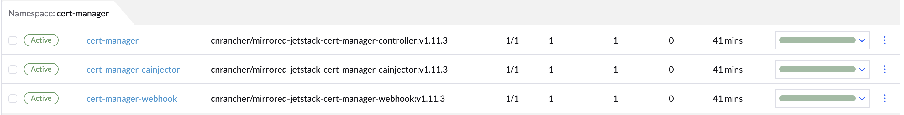
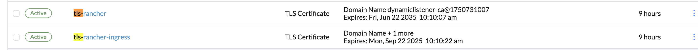
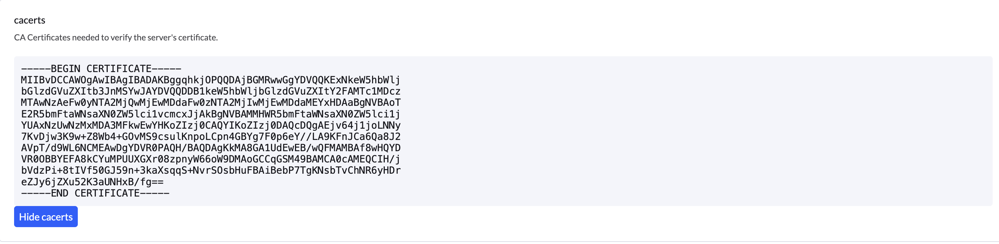
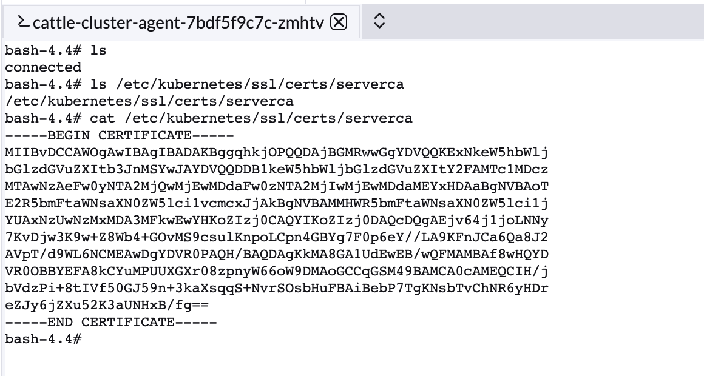

# 自签名证书模式下的 Rancher 工作流程

Rancher 支持三种 TLS 证书来源：

1. **自签名证书**（使用 cert-manager 自动生成并管理）  
2. **Let’s Encrypt 证书**（通过 ACME 协议自动签发）  
3. **已有外部证书**（用户自行提供 Secret）

本文以 **自签名证书** 模式为例，详细说明 Rancher 在通过 Ingress 暴露服务时，如何借助 cert-manager 完成证书的生成、签发与注入。

---

## 1. 前置条件

- 集群中已安装并启用 cert-manager

  

# Rancher 默认 CA 证书生成与分发

## Rancher Server

1. **加载或生成根 CA**  
   Rancher Server在启动时会判断是否需要生成 tls-rancher 这个根证书的 Secret，调用代码位置如下：

    [Rancher Server 启动时加载 tls-rancher Secret](https://github.com/cnrancher/pandaria/blob/3d329eb9de7876f82dc3968a396468798a8fe051/pkg/tls/tls.go#L69)  
    [Rancher Server  创建 tls-rancher Secret](https://github.com/rancher/rancher/blob/8bf56b046af7879386aa5928f50eee678f84b057/pkg/tls/tls.go#L205)

    

2. **Rancher Server 启动带 TLS 的服务**  
   使用上述 CA 和私钥为 Rancher Server 创建 TLS 服务。调用代码位置如下：

    [Rancher Server 的 TLS 服务指定根 CA 证书](https://github.com/cnrancher/pandaria/blob/3d329eb9de7876f82dc3968a396468798a8fe051/pkg/tls/tls.go#L90)

3. **写入全局 Setting**  
   将 PEM 编码的根 CA 存入 `management.cattle.io.settings` 的 `CACerts` 字段，用来给 agent 使用：调用代码位置如下：

    [Rancher Server 存储 CACerts 到 Settings 资源里](https://github.com/rancher/rancher/blob/8bf56b046af7879386aa5928f50eee678f84b057/pkg/tls/tls.go#L209)

    

## Rancher Agent

- **获取并注入根 CA**  
  在部署 Rancher Agent 的脚本中会读取 Rancher Server Settings 中的 `CACerts` 并存储在 Rancher agent 的 `/etc/kubernetes/ssl/certs/serverca` 目录中，代码如下 ：

    [查看 Agent 获取 CA](https://github.com/cnrancher/pandaria/blob/3d329eb9de7876f82dc3968a396468798a8fe051/package/run.sh#L227)

    

- **Agent 使用 `/etc/kubernetes/ssl/certs/serverca` CA 建立与 Rancher server 的链接** ，代码如下：
  
    [建立 v3/connect 统一使用 rootCATransport](https://github.com/cnrancher/pandaria/blob/3d329eb9de7876f82dc3968a396468798a8fe051/cmd/agent/main.go#L223)

## cert-manager 作用
  cert-manager 会根据 Issuer 创建 tls-rancher-ingress 动态的为 rancher server 签发证书，chart 位置如下：
   
   [Issuer 部署的chart](https://github.com/cnrancher/pandaria/blob/3d329eb9de7876f82dc3968a396468798a8fe051/chart/templates/issuer-rancher.yaml#L2)

## 总结

在自签名模式下，Rancher Server 通过 `LoadOrGenCA` 在 cattle-system 命名空间生成或加载根 tls-rancher CA Secret，并写入 Rancher 的 Settings 中，cert-manager 基于 Chart 中预置的 CA Issuer 为 Rancher server 自动签发并续期 tls-rancher-ingress 证书 Secret，Server 启动时挂载这些证书提供 HTTPS 服务。Agent 则通过 Settings API 获取根 CA 并依此构建与 Server 的双向验证 TLS 连接（v3/connect）。