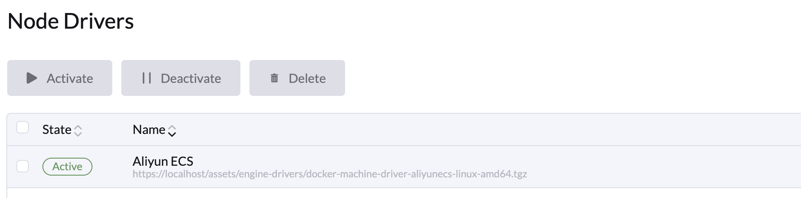

# Rancher 通过阿里云 node-driver 创建 RKE2 集群

Rancher 支持通过阿里云 Node Driver 创建三种类型的集群：RKE1、RKE2 和 K3s。由于 RKE1 即将进入 EOL（End of Life），本文重点介绍 RKE2/K3s 集群的创建逻辑。

## Cluster API 与 CAPR 简述

Cluster API（CAPI）通过一组 Kubernetes 原生 CRD（如 Machine、MachineSet、MachineDeployment）来声明式管理集群生命周期。Rancher 基于 CAPI 设计了 CAPR（CAPI Provider Rancher），在此基础上实现了对阿里云资源的定制化操作。

## 创建 ECS RKE2 流程解析

1. 在前端提交 ECS 集群配置后，Rancher 会先在 rke-machine.cattle.io/v1 API 组下创建一份 Infra 类型的 CRD（统称 InfraMachine），用于描述对阿里云 ECS 实例的规格要求，可以通过在 local 集群执行 `kubectl get aliyunecsconfigs.rke-machine-config.cattle.io -A` 查看。

	

2. Rancher capr Controller 会根据刚刚我们创建的资源创建出对应的 `Machine、MachineSet、MachineDeployment`。

	- Machine：对应单个节点实例，用于描述节点的状态和元数据。

	- MachineSet：管理一组同配置的 Machine，实现节点的扩缩容和一致性。

	- MachineDeployment：在 MachineSet 之上提供滚动更新等高级发布策略。

	
	
3. Rancher machineprovision Controller 会根据刚刚创建出来的 Machine 下发一个 [Job](https://github.com/rancher/rancher/blob/5a22bd393cf252a912caf87e9e3eb3d4cbf12bf4/pkg/controllers/capr/machineprovision/controller.go#L325), 这个 Job 会去通过我们刚刚配置的参数去创建对应阿里云的 ecs 主机。然后对应 controller 会判断主机是否正常运行。如果正常运行之后会触发 RKEBootstrap 相关的逻辑。

4. Job 会通过 ECS Node-driver 去创建阿里云的 ECS 主机， 这个 node-driver 本质上是一个 docker-machine 调用了阿里云的 sdk 根据参数去创建 ECS 主机。

    

5. RKEBootstrap 也监听了 machine 这个资源，当 machine 正常运行时 RKEBootstrap 的 Controller 会创建一个 secret ,secret 会生成一个 Shell 脚本，大致包括：下载并安装 RKE2 ，启动并注册 agent 。[脚本生成代码地址](https://github.com/rancher/rancher/blob/5a22bd393cf252a912caf87e9e3eb3d4cbf12bf4/pkg/controllers/capr/bootstrap/controller.go#L134)。我们的 job 会通过这个 secret 去到 ECS 主机上部署 RKE2。

    

### 总结

Rancher 接收 ECS 配置后，通过 InfraMachine CRD 和 CAPR Controllers 依次生成 Machine/Job，由调用 node-driver 在阿里云创建 ECS 实例，并由 RKEBootstrap 自动生成安装脚本放到 secret 里，然后由 job 执行这个脚本在新实例上部署 RKE2 安装 Rancher Agent。

## 创建 ECS Node Driver 最小权限

Rancher 创建 ECS Node driver 请产考[文档](https://ee.docs.rancher.cn/docs/cloud-drivers/aliyun/ecs#%E6%9C%80%E5%B0%8F%E6%9D%83%E9%99%90)。

注意事项：请确保网络／防火墙策略允许访问所有 aliyuncs.com 域名的子域（即 *.aliyuncs.com），例如 vpc.cn-shanghai.aliyuncs.com、ecs.cn-hangzhou.aliyuncs.com 等

## 安全组端口访问要求

下面是各端口的用途说明：

* **6443/tcp**
  Kubernetes API Server 监听端口，所有控制平面组件、`kubectl`、以及 Rancher 与下游集群通信都要访问此端口。

* **2379/tcp**
  etcd 的客户端通信端口，API Server、控制器管理器等组件通过它读写集群状态。

* **2380/tcp**
  etcd 成员间的对等复制端口，用于集群内 etcd 节点之间同步数据。

* **8472/udp**
  Flannel VXLAN 覆盖网络的默认端口，节点间 Pod 网络流量通过此端口封装转发。

* **4789/udp**
  VXLAN 的 IANA 标准端口（Calico VXLAN 模式或其他 CNI 也可使用），同样用于跨节点的二层数据封装。

* **9796/tcp**
  Rancher 集群监控应用（Prometheus Operator）在每个节点上暴露的指标抓取端口，Prometheus 从这里拉取监控数据。

* **10256/tcp**
  kube-proxy 用于对外提供 `/healthz` 健康检查的端口，LoadBalancer 类型服务的内部流量策略。

* **10250/tcp**
  kubelet API 端口，控制平面与 kubelet 通信（如 exec、logs、metrics）都走这个端口。

* **10251/tcp**
  kube-scheduler 的 HTTP 服务端口，暴露健康检查和调度器内部指标。

* **10252/tcp**
  kube-controller-manager 的 HTTP 服务端口，暴露健康检查和控制器管理器内部指标。
