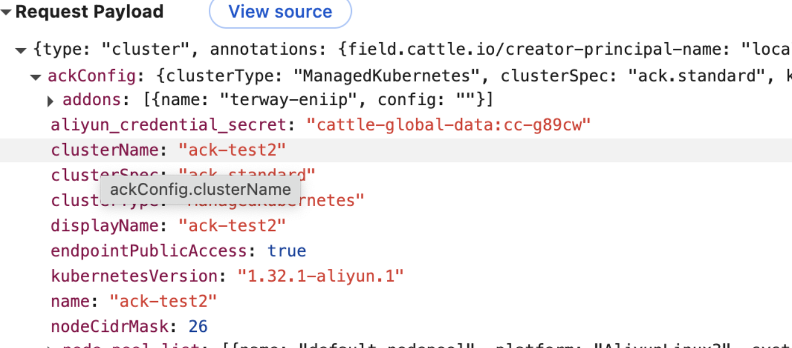
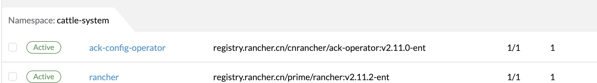

## Rancher 普通导入 ACK/CCE 集群

使用具有 `cluster-admin` 权限的 kubeconfig 执行

```bash
kubectl apply -f <import.yaml>
```

在目标集群中部署 Rancher Agent，待 Agent 启动并与 Rancher Server 建立连接后，即可通过 Rancher UI 对 ACK/CCE 下游集群进行统一管理。

## KEv2（ack-operator/cce-operator）导入 ACK／创建 Custom ACK 集群流程

KEv2 本质上是运行于 Kubernetes 的 Controller（ack-operator 或 cce-operator），它们通过监听特定 CRD 的增删改来完成 ACK 集群的创建或导入。下面重点介绍 Rancher 如何驱动 `ackclusterconfigs.ack.pandaria.io` 这一 CRD。

1. **在 Rancher UI 中新建 ACK 集群**

    * 用户通过 UI 填写 ACK 集群参数后，Rancher 会在管理集群（Mgmt Cluster）的 `spec` 下新增 `ackConfig` 字段，内含所有创建所需设置
    * 可在 Rancher 管理集群中通过 `kubectl -n cattle-system get cluster <cluster-name> -o yaml` 查看
        

2. **生成或更新 ACKClusterConfig CRD**

    * Rancher Server 的管理层 Controller（`ack_cluster_handler.go`）监听 Mgmt Cluster 对象
    * 当检测到 `spec.ackConfig` 被设置时，即自动创建或更新命名空间 `cattle-system 下的 `ackclusterconfigs.ack.pandaria.io` 对象
        [查看源码](https://github.com/cnrancher/pandaria/blob/release/v2.11-ent/pkg/controllers/management/ack/ack_cluster_handler.go#L91)

3. **部署 ack-operator/cce-operator 到目标集群**

    * Rancher Server 的另一个 Controller（`hostedcluster/controller.go`）同样监听 Mgmt Cluster
    * 它会调用 Pandaria-Catalog 中的 `rancher-ack-operator` Chart，在目标集群中安装相应的 Operator
        [查看源码](https://github.com/cnrancher/pandaria/blob/release/v2.11-ent/pkg/controllers/dashboard/hostedcluster/controller.go#L90)
        

## KEv2 ACK/CCE 最小权限请产考

1. Rancher 创建 KEv2 ACK 请产考[文档](https://ee.docs.rancher.cn/docs/cloud-drivers/aliyun/ack#registered-managed-cluster-%E6%9C%80%E5%B0%8F%E6%9D%83%E9%99%90)
2. Rancher 创建 KEv2 CCE 请产考[文档](https://ee.docs.rancher.cn/docs/cloud-drivers/cce/cce#%E5%89%8D%E7%BD%AE%E6%9D%A1%E4%BB%B6)

## 安全组端口访问要求

下面是各端口的用途说明：

* **6443/tcp**
  Kubernetes API Server 监听端口，所有控制平面组件、`kubectl`、以及 Rancher 与下游集群通信都要访问此端口。

* **2379/tcp**
  etcd 的客户端通信端口，API Server、控制器管理器等组件通过它读写集群状态。

* **2380/tcp**
  etcd 成员间的对等复制端口，用于集群内 etcd 节点之间同步数据。

* **8472/udp**
  Flannel VXLAN 覆盖网络的默认端口，节点间 Pod 网络流量通过此端口封装转发。

* **4789/udp**
  VXLAN 的 IANA 标准端口（Calico VXLAN 模式或其他 CNI 也可使用），同样用于跨节点的二层数据封装。

* **9796/tcp**
  Rancher 集群监控应用（Prometheus Operator）在每个节点上暴露的指标抓取端口，Prometheus 从这里拉取监控数据。

* **10256/tcp**
  kube-proxy 用于对外提供 `/healthz` 健康检查的端口，LoadBalancer 类型服务的内部流量策略。

* **10250/tcp**
  kubelet API 端口，控制平面与 kubelet 通信（如 exec、logs、metrics）都走这个端口。

* **10251/tcp**
  kube-scheduler 的 HTTP 服务端口，暴露健康检查和调度器内部指标。

* **10252/tcp**
  kube-controller-manager 的 HTTP 服务端口，暴露健康检查和控制器管理器内部指标。

注意：目前自定义创建 KEv2 ACK 集群，无法选择安全组。默认安全组为 all-open 可以在阿里云自行修改规则。